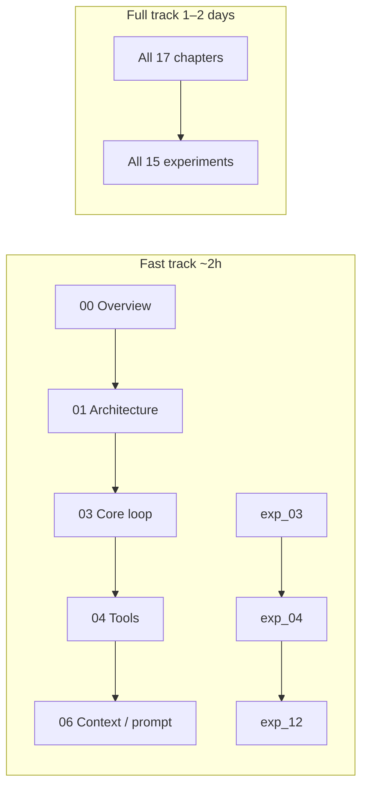
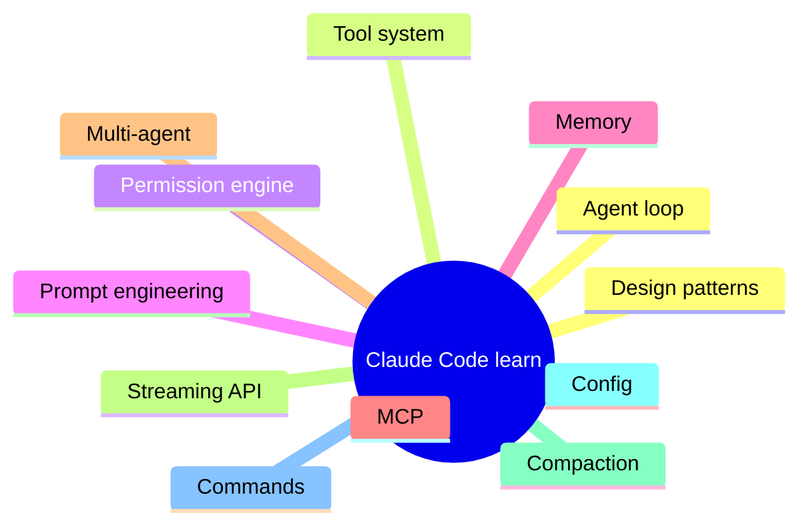

<div align="center">

# Claude Code Internals — Learning Lab

**A structured curriculum for understanding Anthropic’s Claude Code (CLI agent) implementation, grounded in a large TypeScript source snapshot**

[](./docs/en/00-overview.md)
[](./experiments/)
[](#background)
[](./LICENSE)

[简体中文 README](./README_ZH.md) · [Experiments](./experiments/) · [English docs overview](./docs/en/00-overview.md)

</div>

---

## Table of contents

- [Background](#background)
- [Who this is for](#who-this-is-for)
- [Tech stack](#tech-stack)
- [Repository layout](#repository-layout)
- [Getting started](#getting-started)
- [Learning tracks](#learning-tracks)
- [Concept map](#concept-map)
- [Running experiments](#running-experiments)
- [Contributing](#contributing)
- [Acknowledgments](#acknowledgments)
- [License](#license)

---

## Background

**Claude Code** is Anthropic’s **CLI-first coding agent**: it operates on real repositories, reads and writes files, runs commands, calls tools, and converses with the model across many turns. A production implementation spans an **agent loop**, **tool protocol**, **permissions and safety**, **context and prompt assembly**, **memory**, **MCP**, **multi-agent orchestration**, **streaming APIs**, **context compaction**, **configuration**, **command systems**, and more.

This repository — **Claude Code Learn (`learn_claude_code`)** — is a **learning lab** that connects those ideas to engineering practice:

| Dimension | What you get |
|-----------|----------------|
| **Source context** | Material is aligned with a **Claude Code TypeScript snapshot** on the order of **~1,900+ files / 512k+ LOC** (a frozen teaching corpus, not a live upstream mirror) |
| **Docs** | **17 chapters** (`00` overview … `16` design patterns) in **English and Chinese**, plus **experiment guides** under `docs/{en,zh}/experiments/` |
| **Hands-on** | **15 Python experiments** (`exp_02` … `exp_16`) that recreate key patterns, with **Mock / Anthropic / OpenAI** backends |
| **Extensions** | **5** standalone example scripts (`examples/`), **3** step-by-step tutorials (`quick-start/`), glossary (`glossary/`), architecture diagrams (`diagrams/`), and reference cards (`references/`) |

> **Note:** Chapter numbers line up with experiments (e.g. ch.03 core loop ↔ `exp_03_core_agent_loop`) so you can read a chapter and immediately run the matching lab.

---

## Who this is for

- Engineers and researchers who already understand **basic LLM + agent mechanics** (messages, tool calls, multi-turn chat) and want a **production-shaped mental model**  
- Anyone who learns best by **cross-reading a large TypeScript codebase** *and* validating ideas with **small, runnable Python labs**  
- Teams onboarding to **MCP**, **multi-agent**, or **terminal agent UIs** who want a guided map before diving into snapshot files  

If you are brand new to agents, start with the **Mock** run in [Getting started](#getting-started), then pick either the **Fast** or **Full** track below.

---

## Tech stack

### Claude Code (the snapshot you read alongside this repo)

| Area | Typical stack |
|------|----------------|
| Runtime / language | **Bun**, **TypeScript** |
| Terminal UI | **React** + **Ink** |
| CLI | **Commander** (and related tooling) |
| Validation | **Zod** |
| Protocols / SDKs | **MCP SDK**, **Anthropic SDK**, streaming + tool schemas |

### This repository (labs and examples)

| Area | Notes |
|------|--------|
| Language | **Python 3.11+** |
| Dependencies | See [`experiments/requirements.txt`](./experiments/requirements.txt) (`anthropic`, `openai`, `pydantic`, `rich`, `textual`, …) |
| Shared client | [`experiments/shared/`](./experiments/shared/) — unified **LLM** access (**mock**, **Anthropic**, **OpenAI-compatible**) |

---

## Repository layout

```text
learn_claude_code/
├── README.md                    # This file (English, default entry)
├── README_ZH.md                 # Chinese README
├── Makefile                     # Common commands: setup / test / lint / clean
├── pyproject.toml               # Project metadata, ruff & pytest config
├── LICENSE                      # MIT License
├── CONTRIBUTING.md              # Contribution guide (bilingual)
├── CHANGELOG.md                 # Version history
├── .gitignore                   # Git ignore rules
├── .editorconfig                # Editor formatting consistency
│
├── docs/                        # Deep-dive docs (17 chapters + experiment guides)
│   ├── zh/                      # Chinese: 00-overview.md … 16-design-patterns.md
│   │   └── experiments/         # 16 lab write-ups (00 guide + per-chapter labs)
│   └── en/                      # English: same structure
│       └── experiments/
│
├── experiments/                 # 15 Python labs (exp_02 … exp_16)
│   ├── shared/                  # Shared LLM client (Anthropic / OpenAI / Mock) + types
│   ├── exp_02_startup_flow/     # … exp_16_design_patterns/
│   ├── …                        # 15 experiment directories total
│   ├── requirements.txt         # Python dependencies
│   └── README.md                # Index + focused vs comprehensive tracks
│
├── examples/                    # 5 standalone scripts (no external deps)
│   ├── README.md                # Examples guide (bilingual)
│   ├── 01_mini_agent.py         # Minimal agent (~76 lines)
│   ├── 02_tool_use.py           # Tool definition & dispatch
│   ├── 03_streaming.py          # Streaming event assembly
│   ├── 04_memory.py             # File-based memory + TF-IDF
│   └── 05_multi_agent.py        # Multi-agent coordination
│
├── quick-start/                 # 3 step-by-step beginner tutorials
│   ├── zh/                      # Chinese
│   └── en/                      # English
│
├── glossary/                    # Domain terminology (~60 terms)
│   ├── zh.md
│   └── en.md
│
├── diagrams/                    # 5 Mermaid architecture diagrams
│   ├── 01-layered-architecture.md
│   ├── 02-agent-loop-flow.md
│   ├── 03-tool-dispatch.md
│   ├── 04-startup-sequence.md
│   └── 05-multi-agent.md
│
└── references/                  # Quick-reference cards & source maps
    ├── zh/
    └── en/
```

### Chapter ↔ experiment index

| Ch | Doc (`docs/en/*.md` and `docs/zh/*.md`) | Python package |
|----|----------------------------------------|----------------|
| 00 | `00-overview.md` | — |
| 01 | `01-architecture.md` | — |
| 02 | `02-startup-flow.md` | `exp_02_startup_flow` |
| 03 | `03-core-loop.md` | `exp_03_core_agent_loop` |
| 04 | `04-tool-system.md` | `exp_04_tool_system` |
| 05 | `05-permission-security.md` | `exp_05_permission_engine` |
| 06 | `06-context-prompt.md` | `exp_06_prompt_assembly` |
| 07 | `07-memory-system.md` | `exp_07_memory_system` |
| 08 | `08-terminal-ui.md` | `exp_08_terminal_ui` |
| 09 | `09-mcp-integration.md` | `exp_09_mcp_client` |
| 10 | `10-multi-agent.md` | `exp_10_multi_agent` |
| 11 | `11-plugin-skill.md` | `exp_11_plugin_skill` |
| 12 | `12-api-streaming.md` | `exp_12_streaming_api` |
| 13 | `13-config-settings.md` | `exp_13_config_system` |
| 14 | `14-compact-context-mgmt.md` | `exp_14_context_compaction` |
| 15 | `15-command-system.md` | `exp_15_command_system` |
| 16 | `16-design-patterns.md` | `exp_16_design_patterns` |

---

## Getting started

### 1. Open the lab root

If this folder lives inside a larger monorepo:

```bash
cd learn_claude_code
```

Otherwise clone your distribution and `cd` into `learn_claude_code`.

### 2. Virtualenv + dependencies

```bash
cd experiments
python3 -m venv .venv
source .venv/bin/activate          # Windows: .venv\Scripts\activate
pip install -U pip
pip install -r requirements.txt
```

### 3. First experiment (Mock — no API key)

```bash
# Still inside experiments/ with venv active
python -m exp_03_core_agent_loop.main --mock
```

You should see streamed events, state updates, and tool dispatch. Then read [`docs/en/03-core-loop.md`](./docs/en/03-core-loop.md) alongside [`docs/en/experiments/03-core-agent-loop-lab.md`](./docs/en/experiments/03-core-agent-loop-lab.md).

### 4. Using the Makefile (recommended)

```bash
cd learn_claude_code        # back to project root
make setup                  # create venv and install dependencies
make test EXP=03            # run a single experiment
make test-all               # run all 15 experiments
make lint                   # code style check
```

---

## Learning tracks

### Overview (Mermaid)



### Fast track (~2 hours)

| Step | Content |
|------|---------|
| Reading order | `00-overview` → `01-architecture` → `03-core-loop` → `04-tool-system` → `06-context-prompt` |
| Labs | `exp_03_core_agent_loop` → `exp_04_tool_system` → `exp_12_streaming_api` (start with `--mock`) |

**Outcome:** A minimal but accurate picture of **loop + tools + streaming**, ready to map back to the TypeScript snapshot.

### Full track (~1–2 days)

- **Docs:** all **17** chapters under `docs/en/` (or `docs/zh/`), plus experiment guides as needed  
- **Labs:** all **15** experiments under `experiments/` at least once in **Mock** mode (covers most control-flow paths)  

### By interest

| Focus | Chapters | Labs |
|-------|-----------|------|
| **Agent core** | 03, 04, 06, 12, 14 | exp_03, exp_04, exp_06, exp_12, exp_14 |
| **Extensibility** | 09, 10, 11, 13 | exp_09, exp_10, exp_11, exp_13 |
| **Engineering practice** | 02, 05, 13, 15, 16 | exp_02, exp_05, exp_13, exp_15, exp_16 |
| **Terminal / UI** | 08 | exp_08 |

For “focused vs comprehensive” experiment sets, see [`experiments/README.md`](./experiments/README.md).

---

## Concept map

Topics covered mirror the chapter list — the same ideas you would expect in a mature CLI agent:



- **Agent loop** — multi-turn reasoning, termination, feeding tool results back  
- **Tool system** — schemas, registration, dispatch, results  
- **Permission engine** — gating sensitive operations  
- **Prompt engineering** — system prompts, context assembly, constraints  
- **Memory** — what persists across turns or sessions  
- **MCP** — standardized tool/resource integration  
- **Multi-agent** — delegation and merging outputs  
- **Streaming API** — token/event streams and UI consumption  
- **Compaction** — window management and summarization at scale  
- **Config & commands** — flags, settings, slash commands  
- **Design patterns** — recurring structure in a large TS codebase  

---

## Running experiments

Each lab supports three **provider modes** (see also [`experiments/README.md`](./experiments/README.md)):

| Mode | When to use | Notes |
|------|-------------|--------|
| **mock** | Offline, CI, no keys | Deterministic / canned flows; best for control-flow learning |
| **anthropic** | Claude API | Set `ANTHROPIC_API_KEY` |
| **openai** | OpenAI-compatible endpoints | Set `OPENAI_API_KEY` (and base URL if your client requires it) |

### Examples

```bash
cd experiments
source .venv/bin/activate

# Mock (recommended first run)
python -m exp_03_core_agent_loop.main --mock

# Anthropic
export ANTHROPIC_API_KEY="sk-ant-..."
python -m exp_03_core_agent_loop.main --provider anthropic

# OpenAI-compatible
export OPENAI_API_KEY="sk-..."
python -m exp_03_core_agent_loop.main --provider openai
```

Module docstrings in each `main.py` document flags; if a lab is model-sensitive, read the matching `docs/*/experiments/*` guide first.

---

## Contributing

Issues and pull requests are welcome. See [CONTRIBUTING.md](./CONTRIBUTING.md) for guidelines.

Before submitting: run `make test-all && make lint`, ensure no secrets are hardcoded, and keep Chinese/English content in sync.

---

## Acknowledgments

Educational analysis here is grounded in a **Claude Code TypeScript source snapshot**. Thanks to Anthropic and the broader community for agent tooling and the MCP ecosystem. The prose and Python in this repository are **independent teaching materials** — they are **not** official Anthropic product documentation.

---

## License

Learning materials and lab code are released under the [MIT License](./LICENSE).

Any **bundled source snapshot** is for **education and research** only; comply with upstream terms. Do not use this project to imply endorsement or to misrepresent official behavior.

---

<div align="center">

**[简体中文 README](./README_ZH.md)** · Happy learning

</div>
