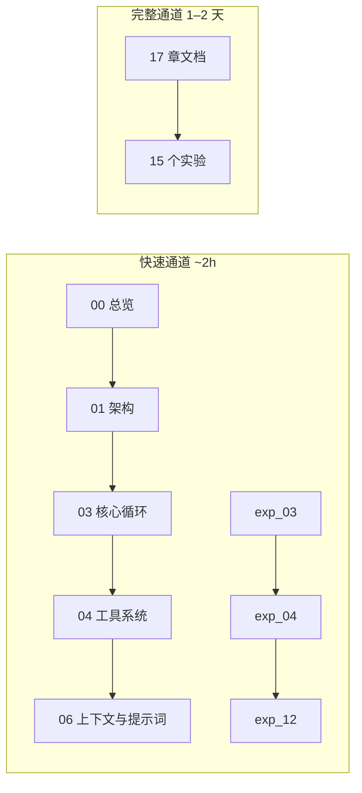
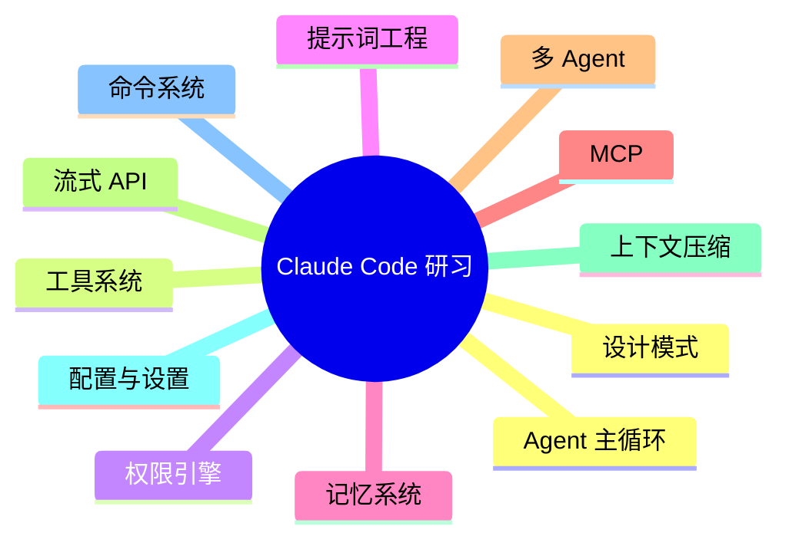

<div align="center">

# Claude Code 源码研习

**基于 TypeScript 源码快照，系统理解 Anthropic Claude Code（CLI Agent）内部实现的学习型项目**

[](./docs/zh/00-overview.md)
[](./experiments/)
[](#项目背景)
[](./LICENSE)

[English README](./README.md) · [实验目录](./experiments/) · [中文文档总览](./docs/zh/00-overview.md)

</div>

---

## 目录

- [项目背景](#项目背景)
- [适合谁](#适合谁)
- [技术栈](#技术栈)
- [仓库结构](#仓库结构)
- [快速开始](#快速开始)
- [学习路径](#学习路径)
- [核心概念地图](#核心概念地图)
- [运行实验](#运行实验)
- [参与贡献](#参与贡献)
- [致谢](#致谢)
- [许可证说明](#许可证说明)

---

## 项目背景

**Claude Code** 是 Anthropic 推出的面向终端/IDE 的 **CLI Agent 工具**：在真实代码库上执行读写、运行命令、调用工具，并与模型多轮对话完成任务。其生产级实现涉及 **Agent 主循环、工具协议、权限与安全、上下文与提示词、记忆、MCP、多 Agent、流式 API、上下文压缩、配置与命令系统** 等完整工程链条。

本仓库 **Claude Code 研习（`learn_claude_code`）** 的定位是：

| 维度 | 说明 |
|------|------|
| **源码语境** | 对齐约 **1900+ 文件 / 51 万行以上** TypeScript 规模的 **Claude Code 源码快照**（教学拆解用，非实时上游镜像） |
| **文档** | **17 章**深度导读（`00` 总览 … `16` 设计模式），中英双语，并配有 **实验指南**（`docs/{zh,en}/experiments/`） |
| **动手实验** | **15 个** Python 迷你实现（`exp_02` … `exp_16`），复现关键模式，支持 **Mock / Anthropic / OpenAI** 三种推理后端 |
| **扩展材料** | `examples`、`quick-start`、`glossary`、`diagrams`、`references` 等目录提供独立示例脚本、分步入门教程、术语表与速查卡 |

> **说明**：文档与实验命名与章节编号对应（例如第 3 章核心循环 ↔ `exp_03_core_agent_loop`），便于「读完一章 → 跑对应实验」。

---

## 适合谁

- 已具备 **基础 LLM / Agent 概念**（消息、工具调用、多轮对话），希望从「玩具 Demo」进阶到 **可上线 Agent 架构** 的工程师与研究者  
- 需要 **对照真实大型 TypeScript 项目** 理解：状态机式主循环、工具注册与执行、权限门控、提示词拼装、记忆与压缩、MCP 与多 Agent 协作  
- 希望用 **Python 小实验** 验证思路，再回读源码与设计文档，形成闭环学习  

若你完全零基础，建议先完成 [快速开始](#快速开始) 中的 Mock 实验，再按 [学习路径](#学习路径) 选「快速通道」或「完整通道」。

---

## 技术栈

### Claude Code（源码快照侧，供对照阅读）

| 类别 | 典型技术 |
|------|-----------|
| 运行时 / 语言 | **Bun**、**TypeScript** |
| 终端 UI | **React** + **Ink** |
| CLI / 解析 | **Commander** 等 |
| 数据校验 | **Zod** |
| 协议与 SDK | **MCP SDK**、**Anthropic SDK**、流式与工具 Schema 相关生态 |

### 本仓库实验与示例（动手侧）

| 类别 | 说明 |
|------|------|
| 语言 | **Python 3.11+** |
| 依赖 | 见 [`experiments/requirements.txt`](./experiments/requirements.txt)（`anthropic`、`openai`、`pydantic`、`rich`、`textual` 等） |
| 共享模块 | [`experiments/shared/`](./experiments/shared/) 统一 **LLM 客户端**（Mock / Anthropic / OpenAI 兼容） |

---

## 仓库结构

```text
learn_claude_code/
├── README.md                    # 英文版 README（默认入口）
├── README_ZH.md                 # 本文件（中文）
├── Makefile                     # 常用命令：setup / test / lint / clean
├── pyproject.toml               # 项目元数据与 ruff / pytest 配置
├── LICENSE                      # MIT 许可证
├── CONTRIBUTING.md              # 贡献指南（中英双语）
├── CHANGELOG.md                 # 版本更新记录
├── .gitignore                   # Git 忽略规则
├── .editorconfig                # 编辑器格式统一
│
├── docs/                        # 深度文档（17 章 + 实验指南）
│   ├── zh/                      # 中文：00-overview.md … 16-design-patterns.md
│   │   └── experiments/         # 16 篇实验导读（00-实验指南 + 各章实验）
│   └── en/                      # 英文：同上结构
│       └── experiments/
│
├── experiments/                 # 15 个 Python 动手实验（exp_02 … exp_16）
│   ├── shared/                  # 共享 LLM 客户端（Anthropic / OpenAI / Mock）与工具类型
│   ├── exp_02_startup_flow/     # … exp_16_design_patterns/
│   ├── …                        # 共 15 个实验目录
│   ├── requirements.txt         # Python 依赖
│   └── README.md                # 实验索引与 focused / comprehensive 轨道说明
│
├── examples/                    # 5 个独立示例脚本（无外部依赖）
│   ├── README.md                # 示例说明（中英双语）
│   ├── 01_mini_agent.py         # 最小 Agent（~76 行）
│   ├── 02_tool_use.py           # 工具定义与调度
│   ├── 03_streaming.py          # 流式事件组装
│   ├── 04_memory.py             # 文件记忆 + TF-IDF
│   └── 05_multi_agent.py        # 多 Agent 协作
│
├── quick-start/                 # 3 篇分步入门教程
│   ├── zh/                      # 中文版
│   └── en/                      # 英文版
│
├── glossary/                    # 领域术语表（~60 个术语）
│   ├── zh.md
│   └── en.md
│
├── diagrams/                    # 5 幅 Mermaid 架构图
│   ├── 01-layered-architecture.md
│   ├── 02-agent-loop-flow.md
│   ├── 03-tool-dispatch.md
│   ├── 04-startup-sequence.md
│   └── 05-multi-agent.md
│
└── references/                  # 速查卡与源码地图
    ├── zh/
    └── en/
```

### 文档章节与实验对应（速查）

| 章 | 文档（zh/en 同名 `.md`） | Python 实验目录 |
|----|--------------------------|-----------------|
| 00 | `00-overview.md` | — |
| 01 | `01-architecture.md` | — |
| 02 | `02-startup-flow.md` | `exp_02_startup_flow` |
| 03 | `03-core-loop.md` | `exp_03_core_agent_loop` |
| 04 | `04-tool-system.md` | `exp_04_tool_system` |
| 05 | `05-permission-security.md` | `exp_05_permission_engine` |
| 06 | `06-context-prompt.md` | `exp_06_prompt_assembly` |
| 07 | `07-memory-system.md` | `exp_07_memory_system` |
| 08 | `08-terminal-ui.md` | `exp_08_terminal_ui` |
| 09 | `09-mcp-integration.md` | `exp_09_mcp_client` |
| 10 | `10-multi-agent.md` | `exp_10_multi_agent` |
| 11 | `11-plugin-skill.md` | `exp_11_plugin_skill` |
| 12 | `12-api-streaming.md` | `exp_12_streaming_api` |
| 13 | `13-config-settings.md` | `exp_13_config_system` |
| 14 | `14-compact-context-mgmt.md` | `exp_14_context_compaction` |
| 15 | `15-command-system.md` | `exp_15_command_system` |
| 16 | `16-design-patterns.md` | `exp_16_design_patterns` |

---

## 快速开始

### 1. 获取代码

若本目录位于更大 monorepo 中：

```bash
cd learn_claude_code
```

若单独分发本学习包，请按你托管平台的说明克隆后进入 `learn_claude_code` 根目录。

### 2. Python 虚拟环境与依赖

```bash
cd experiments
python3 -m venv .venv
source .venv/bin/activate          # Windows: .venv\Scripts\activate
pip install -U pip
pip install -r requirements.txt
```

### 3. 第一个实验（推荐 Mock，免 API Key）

```bash
# 仍在 experiments/ 目录下，且已激活 venv
python -m exp_03_core_agent_loop.main --mock
```

看到流式事件、状态更新与工具调度输出即表示环境正常。随后可阅读 [`docs/zh/03-core-loop.md`](./docs/zh/03-core-loop.md) 与 [`docs/zh/experiments/03-核心Agent循环实验.md`](./docs/zh/experiments/03-核心Agent循环实验.md) 对照实现细节。

### 4. 使用 Makefile（推荐）

```bash
cd learn_claude_code        # 回到项目根目录
make setup                  # 创建 venv 并安装依赖
make test EXP=03            # 运行单个实验
make test-all               # 运行全部 15 个实验
make lint                   # 代码风格检查
```

---

## 学习路径

### 路径总览（Mermaid）



### 快速通道（约 2 小时）

| 步骤 | 内容 |
|------|------|
| 阅读顺序 | `00-overview` → `01-architecture` → `03-core-loop` → `04-tool-system` → `06-context-prompt` |
| 实验顺序 | `exp_03_core_agent_loop` → `exp_04_tool_system` → `exp_12_streaming_api`（均建议先 `--mock`） |

目标：建立 **主循环 + 工具 + 流式** 的最小心智模型，能对照源码快照说出数据流与控制流。

### 完整通道（约 1–2 天）

- **文档**：`docs/zh/`（或 `docs/en/`）下 **17 章全部**通读，实验指南按需选读  
- **实验**：`experiments/` 下 **15 个实验全部**跑通至少一遍（Mock 模式可覆盖大部分逻辑路径）  

### 按兴趣分支

| 兴趣方向 | 建议章节 | 建议实验 |
|----------|-----------|-----------|
| **Agent 核心** | 03、04、06、12、14 | exp_03、exp_04、exp_06、exp_12、exp_14 |
| **扩展与生态** | 09、10、11、13 | exp_09、exp_10、exp_11、exp_13 |
| **工程实践** | 02、05、13、15、16 | exp_02、exp_05、exp_13、exp_15、exp_16 |
| **终端与 UI** | 08 | exp_08 |

更多「聚焦 / 全面」双轨说明见 [`experiments/README.md`](./experiments/README.md)。

---

## 核心概念地图

本研习覆盖 Claude Code 类生产 Agent 中的关键概念（与文档章节一致）：



- **Agent 主循环**：多轮推理、终止条件、与工具结果的再注入  
- **工具系统**：Schema、注册、派发、结果回传  
- **权限引擎**：危险操作门控与用户策略  
- **提示词工程**：系统提示、上下文拼装、角色与约束  
- **记忆系统**：跨会话或任务的状态保留策略  
- **MCP**：外部工具与资源的标准化接入  
- **多 Agent**：分工、委派与结果合并  
- **流式 API**：token / 事件级推送与 UI 消费  
- **上下文压缩（Compaction）**：长对话下的窗口管理与摘要策略  
- **配置与命令**：CLI 标志、设置文件与斜杠命令等  
- **设计模式**：在大型 TS 代码库中反复出现的结构与权衡  

---

## 运行实验

所有实验均支持三种 **推理提供方**（与 `experiments/README.md` 一致）：

| 模式 | 适用场景 | 说明 |
|------|-----------|------|
| **mock** | 离线、CI、无 Key | 使用预设流，不发起外网请求；适合理解控制流 |
| **anthropic** | 对照官方 Claude API | 需配置 `ANTHROPIC_API_KEY` |
| **openai** | OpenAI 兼容端点 | 需配置 `OPENAI_API_KEY`（及可选 base URL，视客户端实现而定） |

### 常用命令示例

```bash
cd experiments
source .venv/bin/activate

# 离线 Mock（推荐首次运行）
python -m exp_03_core_agent_loop.main --mock

# Anthropic
export ANTHROPIC_API_KEY="sk-ant-..."
python -m exp_03_core_agent_loop.main --provider anthropic

# OpenAI 兼容
export OPENAI_API_KEY="sk-..."
python -m exp_03_core_agent_loop.main --provider openai
```

各实验入口模块 docstring 中一般有 `--mock` / `--provider` 的完整说明；若某实验对模型能力要求较高，请优先阅读对应 `docs/*/experiments/*` 导读。

---

## 参与贡献

欢迎通过 Issue / Pull Request 改进本研习材料。详见 [CONTRIBUTING.md](./CONTRIBUTING.md)。

提交前请确保：`make test-all && make lint` 通过、无硬编码密钥、中英文内容同步。

---

## 致谢

本项目的教学分析基于 **Claude Code 的 TypeScript 源码快照**（教育向拆解与重述）。感谢 Anthropic 与开源社区在 Agent 工具链与 MCP 生态上的工作。本仓库文档与 Python 代码为 **独立撰写的学习材料**，用于帮助理解典型架构模式；**不**代表 Anthropic 官方文档或行为承诺。

---

## 许可证说明

本仓库中的学习文档、实验代码与示例依据 [MIT 许可证](./LICENSE) 发布。

**源码快照**（若随仓库提供）仅用于 **教育与研究**，请遵守其原始许可与使用条款。请勿将本材料用于误导性宣称「官方实现」或侵犯第三方权利的场景。

---

<div align="center">

**[English README](./README.md)** · 祝学习愉快

</div>
